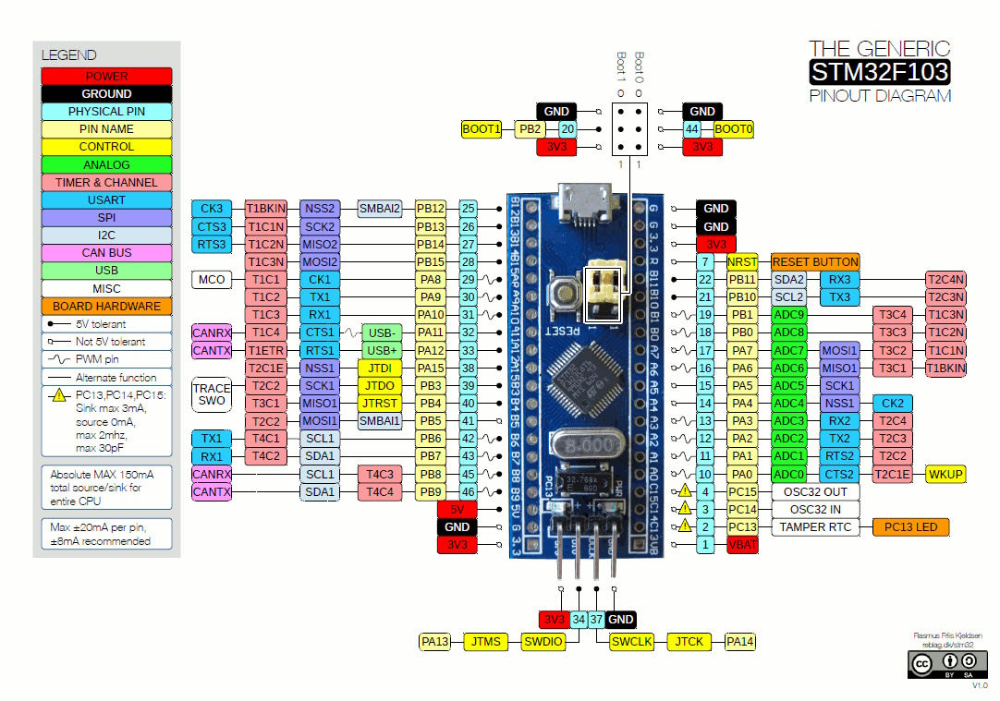

# Stm32 Port Expander

With this sketch you can control pins of a remote Stm32 board through
ESPHome. The Stm32 acts as a port expander, allowing you to use more
pins than a standard ESP8266/ESP32 has.



The Stm32 is connected to the ESP via I²C. 

Currently, it is supported:

> - reading digital inputs
> - reading analog inputs
> - writing digital outputs
> - writing analog outputs

The Stm32 source code (CubeMX) can be retrieved from
[here](https://github.com/eugenscobich/stm32-port-expander)
and you can use the Stm32 IDE to program it.

To setup the [external component](https://esphome.io/components/external_components) add the external component definition to your
yaml:

```yaml
external_components:
  - source:
      type: git
      url: https://github.com/eugenscobich/esphome-components
      ref: main
    refresh: 0s
    components: [stm32_port_expander]
```

Setup your [I²C Bus](https://esphome.io/components/i2c):

```yaml
i2c:
```

Then create a `stm32_port_expander` component hub, this will be the main component we will be referencing later when creating individual IOs.

```yaml
stm32_port_expander:
  - id: stm32_hub1
    address: 0x08
```

By default the I²C `address` is `0x08` but you can change it on the
Stm32 source code so you can have more devices on the same bus.

## `gpio` pins

Use pins as any other port expander in ESPHome, you can use it in almost every place a pin is needed:

```yaml
binary_sensor:
  - platform: gpio
    pin:
      stm32_port_expander: stm32_hub1
      number: 2
      mode:
        input: true # defaults to False
        output: false # defaults to False
```

All pins must be correspondingly configured in Stm32 project. There is no any validation on how pins are configured.

## Sensor

Sensors allows for reading the analog value of an analog pin.

```yaml
sensor:
  - platform: stm32_port_expander
    id: stm32_temperature
    pin: 28
    name: 'Stm32 Temperature'
    update_interval: 10s
```

## Output

Output allows to send output value to Stm32

```yaml
output:  
  - platform: stm32_port_expander
    stm32_port_expander_id: stm32_hub1
    channel: 27
    id: temp_threshold_0

light:
  - platform: monochromatic
    id: light_temp_threshold_0
    name: "Temperature threshold"
    output: temp_threshold_0
```

